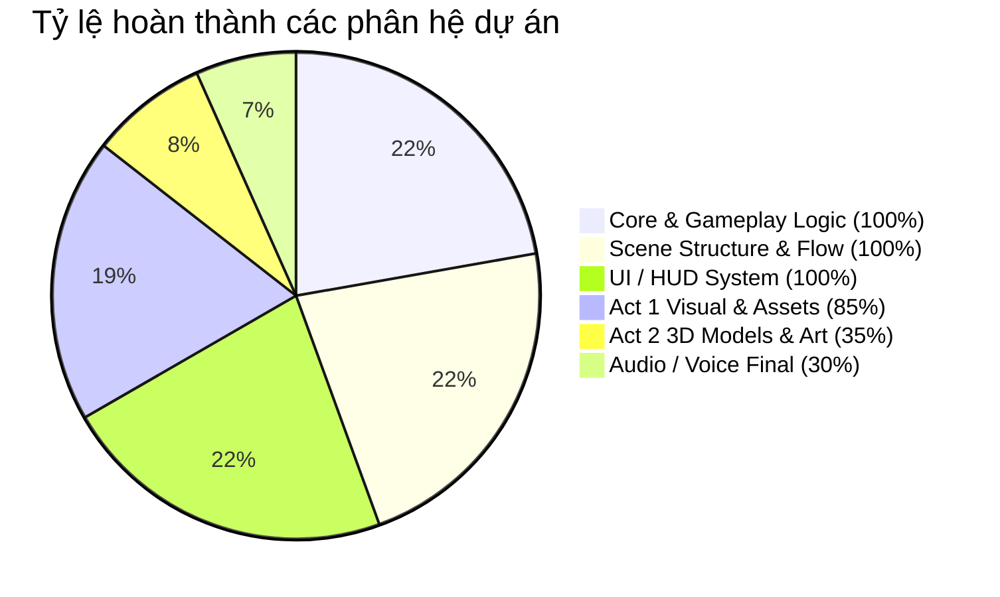

# 📊 BÁO CÁO TIẾN ĐỘ DỰ ÁN — "CHÌA KHÓA KÝ ỨC" (KUTY CHILDHOOD)

> **Cập nhật ngày:** 24/09/2026  
> **Môn học:** PRU213 (Unity Game Development) — Đại học FPT  
> **Nền tảng:** Unity 2022.3.62f3 LTS (URP) | Nền tảng đích: PC (Windows x64)  
> **Repository:** [minhquansicula/KuTyChildhood](https://github.com/minhquansicula/KuTyChildhood.git)

---

## 1. TỔNG QUAN DỰ ÁN

| Hạng mục | Thông tin chi tiết |
| :--- | :--- |
| **Tên dự án** | KuTy Childhood — Chìa Khóa Ký Ức |
| **Thể loại** | First-Person Narrative Exploration & Mini-games / Puzzle nhẹ |
| **Góc nhìn** | Góc nhìn thứ nhất (First-Person Perspective) |
| **Phong cách đồ họa** | 3D Chibi / Low-poly hoài niệm (Tương phản giữa văn phòng u tối và tuổi thơ ấm áp) |
| **Thời lượng trải nghiệm** | ~15 – 25 phút/lượt chơi |
| **Thông điệp** | Tuổi thơ giản dị, tình yêu gia đình và những ước mơ thuở nhỏ là "chìa khóa" giúp chữa lành và giải thoát tâm hồn khỏi những ngột ngạt, áp lực công việc của cuộc sống người lớn. |

---

## 2. TỔNG KẾT TIẾN ĐỘ THỰC HIỆN

### Đánh giá chung:
- **Khung Logic, Gameplay, Hệ thống code (100%):** Toàn bộ luồng cốt truyện 3 Hồi đã liên kết và vận hành hoàn chỉnh từ đầu đến cuối. Người chơi có thể đi hết từ Main Menu -> Hồi 1 (Văn phòng) -> Hồi 2 (Thế giới ký ức) -> Hồi 3 (Kết thúc) -> Chơi lại.
- **Tích hợp Scene & Đồ họa Hồi 1 (85%):** Đã import và dựng không gian văn phòng thực tế với Model FBX văn phòng, bàn làm việc, vật liệu (Materials, Textures), ánh sáng URP (đèn huỳnh quang, vệt nắng chiều rọi bàn người chơi, ánh xanh bóng sếp).
- **Hồi 2 & 3 (35%):** Đang hoạt động ở dạng **Playable Prototype / Greybox**. Code logic, tương tác, minigame (rửa chén, bắn bi, shop, nhật ký, mở khóa) đã chạy chuẩn 100%, chờ thay thế các hình khối greybox bằng 3D Model hoàn thiện.
- **Kiểm thử tự động (100%):** Đã xây dựng bộ Smoke Test (`KuTySmokeTests.cs`) kiểm tra tự động vượt qua 54–69 assertions toàn bộ luồng game. Build Windows x64 chạy ổn định.

---

## 3. CHI TIẾT TIẾN ĐỘ TỪNG PHÂN HỆ

### 3.1. Luồng cốt truyện & Các Scene (Story Flow)

| Màn chơi / Hồi | Trạng thái Logic | Trạng thái Asset/Đồ họa | Chi tiết hiện trạng |
| :--- | :---: | :---: | :--- |
| **MainMenu** | ✅ Hoàn thành | 🟡 Cơ bản | Giao diện nút Chơi, Thoát; khởi tạo hệ thống âm thanh, chuyển cảnh mượt mà qua SceneLoader. |
| **Hồi 1: Văn phòng ngột ngạt** (`Act1_RealWorld`) | ✅ Hoàn thành | 🟢 Đã có 3D FBX | • Người chơi di chuyển, nhìn quanh phòng làm việc. • Phụ đề sếp quát hiện trên màn hình. • Bàn người chơi: Đọc báo cáo lỗi trên laptop -> Xem hồ sơ -> Giữ chuột sửa báo cáo. • Tương tác cửa kính nhìn bóng sếp. • Tương tác ghế ngồi nghỉ ngơi (`OfficeChair`) để chuyển cảnh sang Hồi 2. • Đèn vàng vệt nắng chiều, đèn huỳnh quang kêu rè, tiếng còi xe ngoài cửa sổ. |
| **Hồi 2: Thế giới ký ức** (`Act2_MemoryWorld`) | ✅ Hoàn thành | 🟡 Greybox Prototype | Gồm 3 khu vực nằm liền mạch trên 1 scene duy nhất: 1. **Gian bếp (Ký ức 1):** Rửa 5 chiếc chén (giữ chuột hoàn thành thanh Progress bar), nhận 2.000đ và Ký ức về Mẹ. 2. **Tiệm tạp hóa (Ký ức 2):** Dùng tiền mua Kẹo mút (500đ) và Hũ bi ve (1.500đ), nhận Ký ức về Niềm vui giản dị. 3. **Sân chơi (Ký ức 3):** Minigame bắn bi vật lý (Rigidbody kéo lực đẩy 3 bi đỏ ra ngoài vòng), nhận Ký ức Bạn bè. 4. **Ghép chìa khóa:** Mở cuốn nhật ký -> Mở khóa Chìa khóa ước mơ (`DreamKeyVisual`) -> Mở cửa xích (`ChainedDoor`). |
| **Hồi 3: Màn kết thức tỉnh** (`Act3_Ending`) | ✅ Hoàn thành | 🟡 Hoàn thiện chữ | Hiệu ứng fade trắng, hiển thị thông điệp cốt lõi và nút Chơi lại (Restart). |

---

### 3.2. Hệ thống Gameplay & Scripting

| Script / Phân hệ | Nhiệm vụ | Trạng thái | Ghi chú |
| :--- | :--- | :---: | :--- |
| `GameManager` | Quản lý vòng đời game, trạng thái Pause, con trỏ chuột, singleton. | ✅ Hoàn thành | DontDestroyOnLoad |
| `SceneLoader` | Chuyển cảnh bất đồng bộ kèm hiệu ứng Fade In / Fade Out màn hình. | ✅ Hoàn thành | Hỗ trợ đổi màu fade tùy cảnh |
| `FirstPersonController` | Điều khiển nhân vật di chuyển (WASD), góc nhìn chuột, chạy (Shift). | ✅ Hoàn thành | Giới hạn góc nhìn mượt mà |
| `PlayerInteraction` | Bắn Raycast tương tác phím [E] qua Interface `IInteractable`. | ✅ Hoàn thành | Tự đổi crosshair và hiện prompt |
| `QuestManager` | Quản lý trình tự nhiệm vụ theo kịch bản xuyên suốt Hồi 1 & Hồi 2. | ✅ Hoàn thành | Single source of truth |
| `DishWashingGame` | Minigame rửa chén dùng thanh tiến trình (Hold mouse button). | ✅ Hoàn thành | Tính đúng kinh tế 2.000đ |
| `MarbleShootingGame` | Minigame bắn bi vật lý 3D kéo nhắm thả lực. | ✅ Hoàn thành | Vật lý Rigidbody chân thực |
| `CurrencyManager` | Quản lý tiền xu (đồng) của người chơi. | ✅ Hoàn thành | Reset theo từng lượt chơi |
| `InventoryManager` | Túi đồ lưu trữ các vật phẩm đã mua (Kẹo, Bi ve). | ✅ Hoàn thành | Tích hợp ScriptableObject |
| `MemoryCollectionManager` | Quản lý 3 mảnh ký ức đã thu thập được. | ✅ Hoàn thành | Báo hiệu cho DreamKey |
| `DreamKeyController` | Kích hoạt chìa khóa 3D xuất hiện khi đủ 3 ký ức. | ✅ Hoàn thành | Tích hợp mở cửa |
| `ChainedDoorInteractable` | Cửa xích yêu cầu chìa khóa ước mơ để mở sang Hồi 3. | ✅ Hoàn thành | Kiểm tra điều kiện mở cửa |

---

### 3.3. Hệ thống Giao diện (UI System)

- [x] **HUDController:** Tâm ngắm (crosshair), thông báo gợi ý phím [E], thông tin nhiệm vụ hiện tại, bảng hiển thị số tiền.
- [x] **DialogueUI:** Hiển thị lời thoại, phụ đề dẫn truyện (sếp quát, độc thoại nội tâm).
- [x] **JournalUI:** Giao diện cuốn sổ nhật ký theo dõi tiến độ thu thập 3 mảnh ký ức.
- [x] **ShopUI & ShopItemSlotUI:** Giao diện cửa hàng tạp hóa hiển thị danh sách vật phẩm, giá tiền, mô tả và nút mua.
- [x] **MarbleAimUI:** Đường dẫn / vạch chỉ hướng lực khi kéo bắn bi.
- [x] **ProgressBarUI:** Thanh chạy tiến độ tương tác (sửa báo cáo, cọ rửa chén).
- [x] **PauseUI & EndingUI:** Menu dừng game và màn kết thúc.

---

### 3.4. Âm thanh (Audio System)

- [x] `AudioManager` (Singleton) & `SoundLibrary` (ScriptableObject) quản lý BGM và SFX.
- [x] Bộ âm thanh môi trường Act 1 (`OfficeAtmosphere`): Tiếng rè đèn huỳnh quang, tiếng còi xe ngoài phố, tiếng gõ phím.
- [ ] *(Cần bổ sung)*: Nhạc nền BGM cảm xúc chính thức (BGM tuổi thơ acoustic/piano hoài niệm), lồng tiếng thoại (Voice acting) cho sếp và mẹ.

---

## 4. KẾ HOẠCH BƯỚC TIẾP THEO (NEXT STEPS)

Dự án hiện đã hoàn tất toàn bộ **bộ khung kỹ thuật (Functional Prototype)**. Các công việc cần tập trung trong giai đoạn tới gồm:

1. **Thay thế Greybox của Hồi 2:**
   - Đưa 3D model chân thực vào Scene `Act2_MemoryWorld`: Gian bếp Việt xưa, bồn rửa chén bằng xi măng/nhôm, quầy tiệm tạp hóa cổ điển với bánh kẹo tuổi thơ, nền đất/sân gạch chơi bắn bi.
   - Thay model chìa khóa ước mơ phát sáng và cánh cửa cổ tích.
2. **Nâng cấp Đồ họa & Post-Processing (URP):**
   - Tinh chỉnh URP Volume (Color Adjustments, Bloom, Depth of Field, Vignette) để tạo tương phản thị giác: Act 1 tông xám lạnh/u ám; Act 2 tông vàng ấm áp rực rỡ; Act 3 trắng sáng thanh thản.
3. **Hoàn thiện mảng Âm thanh (Audio Polish):**
   - Thu âm hoặc thêm voice sếp quát và tiếng mẹ gọi con.
   - Thêm nhạc nền BGM hoài niệm, sâu lắng khi bước vào ký ức.
   - Bổ sung SFX tiếng nước rửa chén, tiếng leng keng va chạm của bi ve thủy tinh.
4. **Kiểm thử trên nhiều máy & Chuẩn bị Demo/Báo cáo:**
   - Đóng gói file cài đặt (Windows Build standalone).
   - Chuẩn bị video trailer / gameplay demo và slide báo cáo môn học PRU213.

---

> 📌 **Tài liệu tham khảo liên quan:**
> - [Kế hoạch chi tiết 5 tuần (Development Plan)](development-plan.md)
> - [Tài liệu thiết kế trò chơi (GDD)](game-design-document.md)
> - [Hướng dẫn triển khai & gắn asset vào Unity](implementation-guide.md)
> - [Hướng dẫn & thông số cảnh Văn phòng Act 1](office-scene.md)
> - [Kết quả kiểm thử & nghiệm thu kỹ thuật](verification-results.md)
